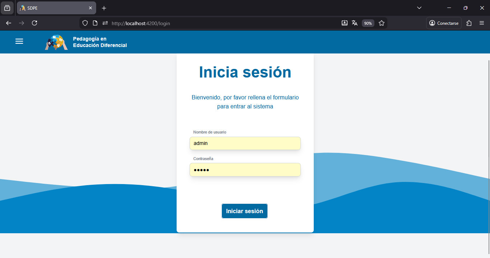
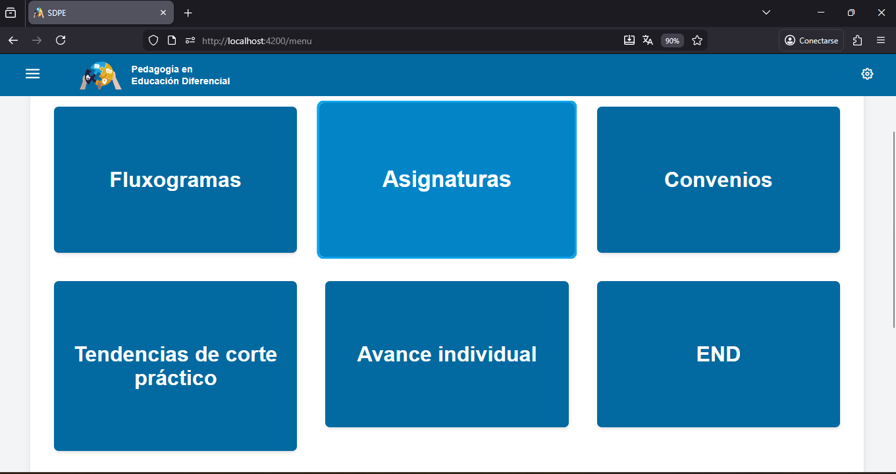
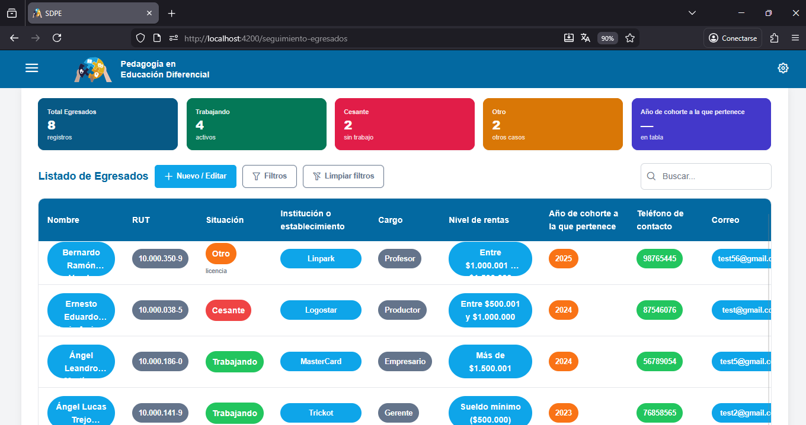

SDPE
Sistema de progresión estudiantil para la carrera de Pedagogía en Educación Diferencial de la UTA

📘 README: Sistema de Seguimiento de Egresados - Educación Diferencial

🧠 Descripción

Este proyecto tiene como objetivo desarrollar una plataforma digital para el seguimiento de egresados de la carrera de Pedagogía en Educación Diferencial de la Universidad de Tarapacá (UTA). Permite recopilar, visualizar y analizar datos sobre la trayectoria profesional de los titulados, facilitando la toma de decisiones académicas y administrativas.

🚀 Funcionalidades principales

Registro de egresados con datos personales y académicos

Encuestas de seguimiento laboral y profesional

Panel administrativo para gestión de usuarios y visualización de estadísticas

Exportación de datos para informes institucionales

🛠️ Tecnologías utilizadas

Frontend: HTML, CSS, TypeScript

Backend: Node.js / Express (presunto)

Base de datos: MongoDB o MySQL (según configuración)

📦 Instalación

# Clonar el repositorio
https://github.com/JoeAre5/SEGUIMIENTO-EGRESADOS-EDUCACION-DIFERENCIAL.git

# Instalar dependencias
cd frontend
npm install

cd ../backend
npm install

# Ejecutar el proyecto
npm start

📸 Capturas de pantalla

Capturas de pantalla del sistema

A continuación se presentan descripciones de las interfaces principales del sistema:

Pantalla de inicio de sesión: Interfaz para que los usuarios ingresen con su nombre de usuario y contraseña para acceder al sistema.

Menú principal: Panel con opciones y módulos disponibles, como acceso a actividades prácticas, seguimiento de egresados y actividades de titulación.

Panel de seguimiento de egresados: Dashboard que muestra estadísticas sobre la situación laboral de los egresados, incluyendo total de registros, cantidad trabajando, cesantes y otros casos, además de un listado detallado con información personal y laboral.

Estas capturas reflejan la funcionalidad y diseño del sistema en desarrollo.

📄 Licencia

Este proyecto está bajo la Licencia GPL-3.0. Consulta el archivo LICENSE.txt para más detalles.